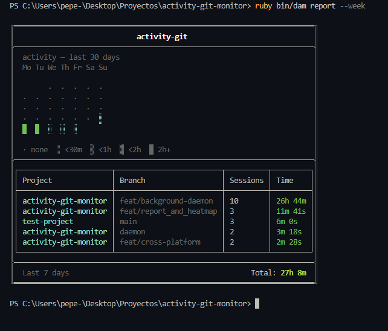
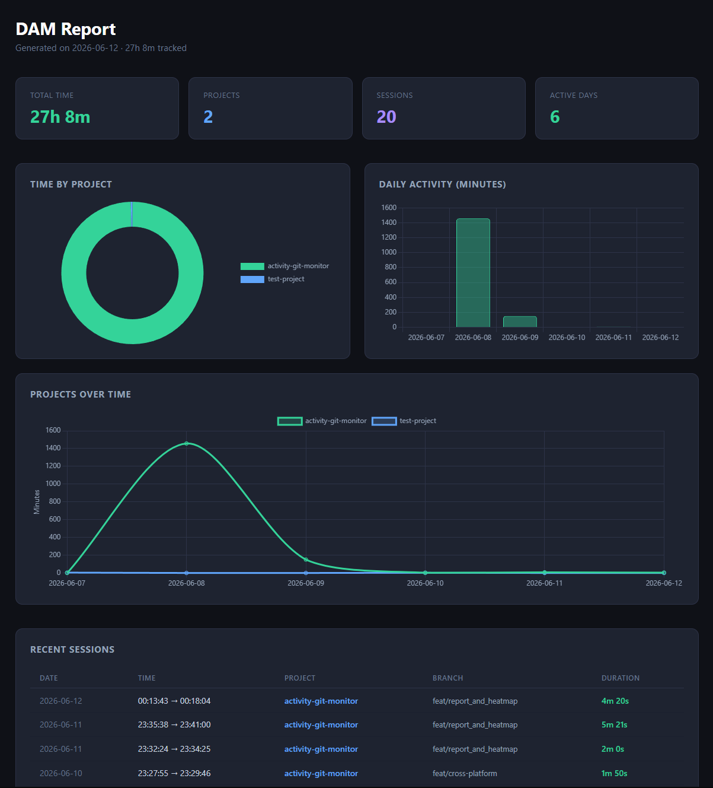

# Activity Git Monitor

A lightweight CLI tool that tracks how much time you spend on each git project and branch — automatically, in the background.

DAM runs a local daemon that detects the project and branch you're working on, logs sessions to a local SQLite database, and gives you clean reports right in your terminal — or as a standalone HTML dashboard.

---

## Features

-  **Automatic session tracking** — detects project and branch from your current working directory
-  **Terminal reports** — activity heatmap + summary table, styled and boxed
-  **HTML export** — generate a standalone dashboard with charts (time by project, daily activity, projects over time, recent sessions)
-  **Local-first** — everything stored in SQLite (WAL mode) on your machine, no cloud, no accounts
-  **Cross-platform** — Windows, Linux (macOS support planned)

---

## How it works

```bash
cd ~/projects/my-app
ruby dam start    # starts tracking the current git project
ruby dam stop     # stops the daemon cleanly
```

DAM detects the project name and active branch from the directory where `dam start` is run. Sessions shorter than 5 seconds are ignored, and idle periods automatically close the current session.

---

## Commands

| Command | Description |
|---|---|
| `dam start` | Start the background daemon, tracking the current directory |
| `dam stop` | Stop the daemon cleanly |
| `dam status` | Show whether the daemon is running |
| `dam logs` | Show recent daemon logs |
| `dam today` | Show today's activity (heatmap + summary) |
| `dam report --week` | Show the last 7 days |
| `dam report --month` | Show the last 30 days |
| `dam export --week` / `--month` | Export an HTML dashboard report |

---

## Screenshots

### Terminal report



### HTML dashboard



`dam export --week` generates a standalone HTML file with interactive charts: time distribution by project, daily activity, and a timeline of sessions.

---

## Installation

DAM is currently run from source. A packaged release (gem / installer) is planned for a future version.

### Requirements

- Ruby 3.3+
- Git
- Windows 10/11 (Linux support implemented, macOS not yet)

### Setup

```bash
git clone https://github.com/pepenodev/activity-git-monitor.git
cd activity-git-monitor
bundle install
```

Run commands with:

```bash
ruby bin/dam start
ruby bin/dam today
```

---

## How sessions are tracked

- The daemon polls every 10 seconds, checking the current branch of the tracked project via `git`
- Sessions shorter than 5 seconds are discarded
- After 2 minutes without detected activity, the current session is closed
- On Windows, the daemon runs as a hidden background process; on Linux/macOS it runs as a spawned process
- Stopping the daemon is done via a control file (`~/.dam/stop`), not OS signals — this keeps behavior consistent across platforms

---

## Data storage

All data is stored locally in SQLite at `~/.dam/sessions.db`, using WAL mode to avoid lock conflicts between the daemon (writing) and the CLI (reading).

---

## Roadmap

- [x] v0.1.0 — Daemon, Database, basic CLI
- [x] v0.2.0 — Real background process, WAL mode, control file stop
- [x] v0.3.0 — Cross-platform session detection (CWD-based), terminal heatmap, styled reports, HTML export dashboard
- [ ] v0.4.0 — VSCode extension (sidebar panel, auto-start, live session view)
- [ ] Packaged installer / gem release

---

## Contributing

This project follows a `feature → dev → main` branching model. Pull requests should target `dev`.

---

## License

MIT
